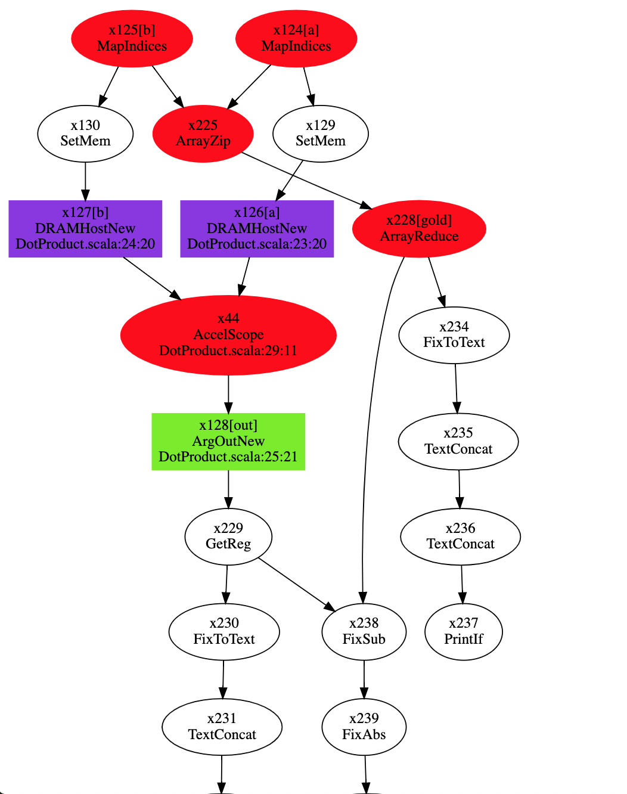
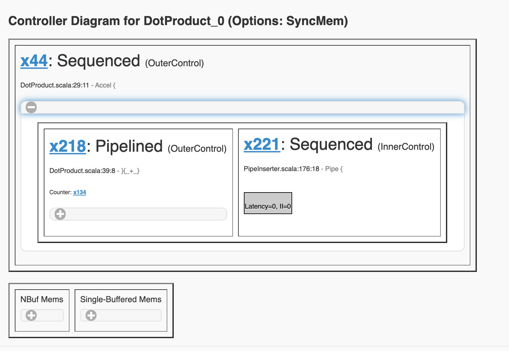
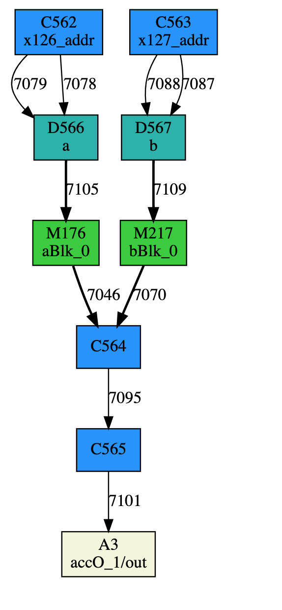
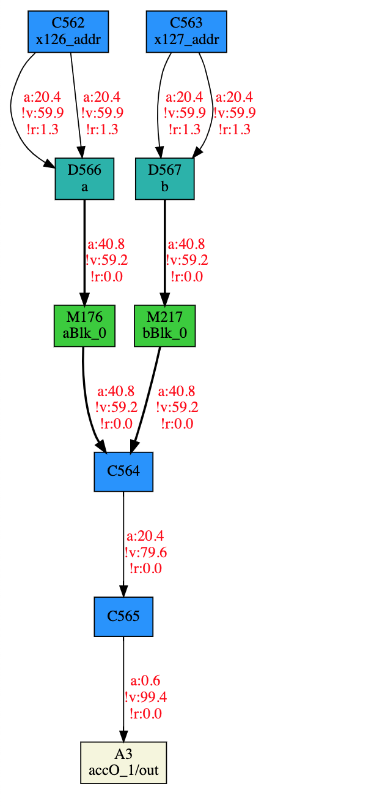
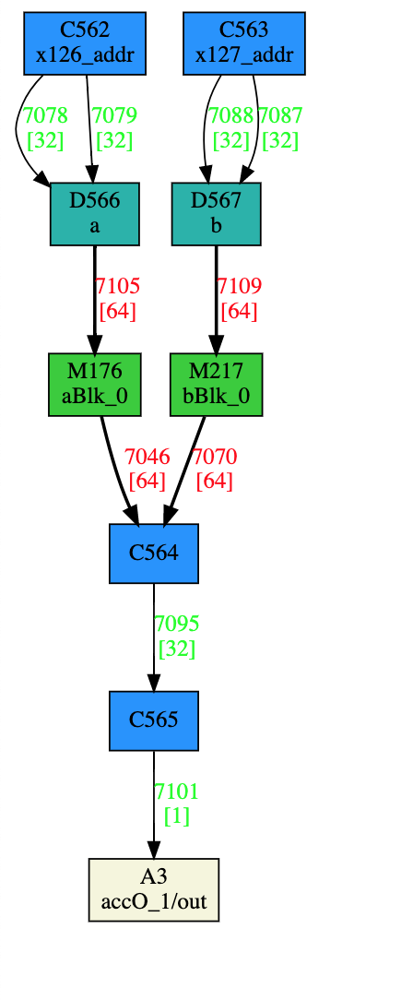
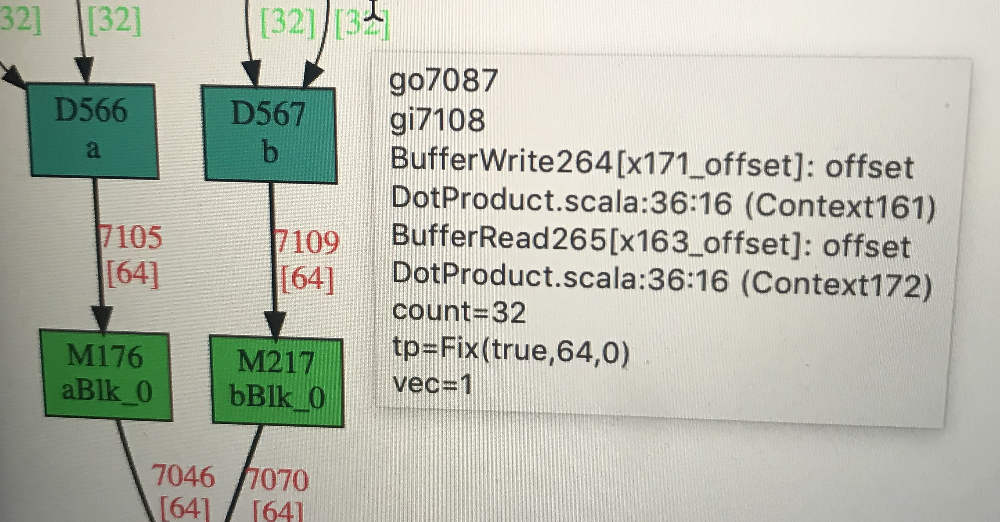

[README](../README.md)

# Instrumentation

## Compiler Flags for Debugging

- `-T` when running `bin/test`. This flag prints logs for each pass, which can make it easier to
  tell which pass the error is coming from. You can also track status and error message of each pass
  with `bin/log <gendir>`. More detail in [Quick Start](QUICKSTART.md).

- `--debug` PIR flag. Turn on logging in pir. Recommend to turn off in batch jobs.

- `--dot` and `--vdot` PIR flag. Generate dot graph. Recommend to turn off in batch jobs.

All PIR flags can be specified when running `bin/test` or within `$HOME/.pirconf`.

## Logs
When using bin/test to run spatial app, there will be a summary log for each of the pass described
in [Quick Start](QUICKSTART.md) in `<gendir>/log`, e.g.
`spatial/gen/Tst_pirTest/DotProduct_0/log/genpir.log`.  `bin/log` parses these logs to produce a
summary of useful informations.

Spatial produces one log file per spatial pass name 00XX-PassName.log in the same directory, e.g.
0000_Staging.log 

PIR also produces a per PIR pass log file when enable logging with `--debug`, and the logs are in 
`<gendir>/pir/logs/`.

## Visualization

Both spatial and PIR have visualization of the IRs. Spatial dot graph is enabled by default if
running with `bin/test -b Tst`. Otherwise it can be turned on with `--dot` when running spatial with
`bin/spatial`.
PIR `--dot` enables the CU-level dot graph and `--vdot` enables
the context- and IR-level dot graph, which can run really slowly for large apps.

### Spatial Visualization
After spatial compilation (genpir pass), the spatial IR is shown as a hierarchical dot graph at each
block level in `<gendir>/info/`. The `Top.html` is the top-level IR under main function scope in
spatial. The red ovals are Block node. Clicking on those node will navigates to scope within the
block. Generally you want to look for the `Accel` block within `Top.html` to show IRs within the
Accel block.



Spatial also contains an expandable controller tree diagram in the same directory called `controller_tree.html`, 
which shows a more concise view of the controller hierarchy.



### PIR Visualization
The most useful visualization would be the Virtual Unit dataflow graph after PIR compilation in
```
<gendir>/pir/out/dot/global.html
```



Each node within the graph corresponds to a virtual unit (VU) that will be placed and routed onto a
physical tile on the chip.

The color of a VU denotes the VU type:

- blue: virtual compute unit
- cyan: memory controller interface
- green: virtual memory unit
- white: host node

Edge: 

- bold: vector link
- regular: scalar link

The variable names of memories declared in spatial app will show up in VUs that contain them.
DRAM variable names will show up in the memory controller interface units that load or store to them.
More useful information related to source code line number will show up when **hovering over** the
node or edge labels of the dot graph. 

Numbers next to the edges are output edge ID, which can be used to associate to simulation
instrumentation.

## Simulation Instrumentation
During simulation, you can turn on the instrumentation logs of individual modules for debugging.
Depends on how many modules are turned on for logging, logging can substantially slow down
simulation.

To turn on logging of a specific module, add `logon <module name>` right before `log2files` in
`<gendir>/tungsten/script`. If remove `log2files`, all logs will print to STDOUT.
Each module will be log to a individual file in `<gendir>/tungsten/logs/<module name>.log`. 

`<module name>` can use wildcard matching. `e.g. logon go*` will turn on logging for all modules
with name starting with `go`, which are virtual unit outputs shown in the `global.html`.
For example the edge with ID `7109` in `global.html` graph corresponds to `go7109.log` in the
generated logs.

If no module name is provided, all modules will be logged. However, **there's a limit on how many file
descriptors can be opened at the same time.** So logging too many modules might result in some modules
not showing up in the log file. `logon` without module name is not recommended.

After simulation, another file `<gendir>/tungsten/logs/state.json` stores information about the
simulation as well as end states of each module. 
Here are some of the performance counters for some of the modules:

- active: number of cycle the module was active
- inactive: number of cycle the module was inactive
- valid: number of cycle the buffer contains element
- ready: number of cycle the buffer was not full
- stall: number of cycle the buffer was full
- starve: number of cycle the buffer was empty
- nelem: number elements in the buffer after simulation
- cont\_inactive: number of cycles the module continuously inactive right before the end of the
simulation. Used to determine deadlock.

You can run `python3 bin/annotate.py` in `<gendir>/tungsten` that will backward annotate some of 
these module states to the virtual unit dataflow graph in `<gendir>/pir/out/dot/gsim.html`. 

### Performance Debugging

If your app finished without deadlock, the graph will look like



The edge is annotated with 

- a: percentage of the runtime the link is active 
- !v: percentage of the runtime the link is not valid/starving
- !r: percentage of the runtime the link is not ready/stalling

If most of the links are running at a low active rate, the app is either DRAM-bound or imbalanced.
You can tell weather the app is DRAM-bound by looking at achieved DRAM bandwidth printed during
simulation, or in `<gendir>/log/runp2p.log`. `bin/log` also parses this number.
If your app is imbalanced, find the VU with highest output link activation rate, and parallelize
around this VU. Hover over the VU to find the corresponding controller source code line number.

### Deadlock Debugging

If your app finished with deadlock, the graph will look like



The edge are marked with edge IDs, and the number under the edge ID within the bracket are number of
cycle the edge was active. The color of the label means:

- green: the edge as sent number of elements expected by static analysis of the compiler. 
- yellow: the edge is stalling
- read: the edge is starving

The expected number of elements sent on a link analyzed by the compiler is shown as `count=<#>` when 
hovering over the link label. 



If count is not printed, it means the expected number of elements cannot be statically analyzed
either because the producer is under a controller with data-dependent iterations or a streaming
stateless controller. If the count cannot be statically analyzed, the edge will be in red even if
all expected elements were sent over the link.
